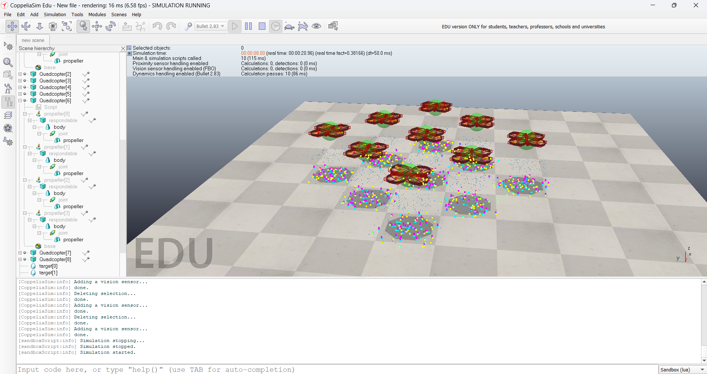
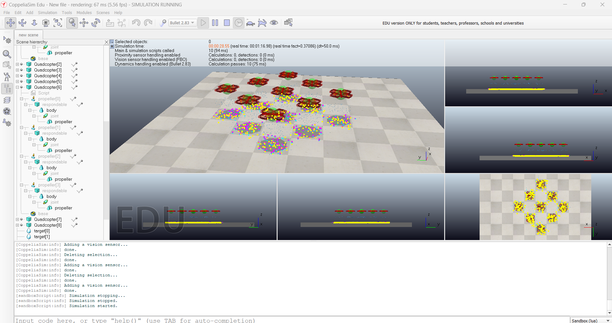

# Autonomous UAV Swarm Coordination System

<p align="center">
  
</p>

<p align="center">
  Multi-UAV autonomous swarm simulation using CoppeliaSim, ROS concepts, Python-based coordination, and real-time formation control.
</p>

---

# Overview

This project presents the design and implementation of an **Autonomous UAV Swarm Coordination System** capable of:

- Multi-drone synchronized movement
- Autonomous formation control
- Precision payload deployment
- Communication delay handling
- Leader-follower coordination
- Dynamic mission behavior simulation

The system was developed and tested using **CoppeliaSim**, Python scripting, and ROS experimentation to simulate real-world swarm intelligence and autonomous UAV coordination scenarios.

---

# Project Motivation

Modern UAV systems are rapidly moving toward:

- Autonomous coordination
- Distributed intelligence
- Swarm-based defense systems
- Search & rescue operations
- Precision aerial missions
- Multi-agent robotics

This project explores how multiple UAVs can collaboratively operate in a coordinated swarm while maintaining formation stability and synchronized behavior in dynamic environments.

---

# Key Features

- Autonomous UAV swarm simulation
- Multi-agent coordination
- Formation control algorithms
- Leader-follower architecture
- PID-based stabilization
- Real-time synchronization
- Payload deployment mechanism
- Communication delay tolerance
- Dynamic UAV formations
- Distributed control concepts

---

# Technologies Used

| Technology | Purpose |
|---|---|
| CoppeliaSim | UAV simulation environment |
| Python | Swarm coordination logic |
| Lua Scripts | Embedded drone scripting |
| ROS | Robotics middleware experimentation |
| PID Controllers | Flight stabilization |
| Remote API | External simulation control |

---

# Simulation Platforms Explored

During development, multiple UAV simulation environments were explored:

| Platform | Status |
|---|---|
| Gazebo + ROS | Version compatibility issues |
| ArduPilot | Initial experimentation |
| Microsoft AirSim | Plugin and GPU limitations |
| Webots | Multi-drone integration challenges |
| CoppeliaSim + Python | Successful implementation |

This experimentation helped build deeper understanding of UAV simulation ecosystems and autonomous robotics workflows.

---

# System Architecture

The project follows a **leader-follower swarm coordination architecture**.

### Workflow:
1. One UAV acts as the leader
2. Follower drones maintain predefined positional offsets
3. PID controllers stabilize flight dynamics
4. Synchronization logic coordinates real-time movement
5. Communication signals propagate swarm updates

---

# Formation Control

The UAV swarm dynamically maintains coordinated formations such as:

- Square formation
- Line formation
- Symmetric coordinated movement

Formation updates are calculated relative to the leader drone’s position using real-time positional offsets.

---

# Payload Deployment System

Each UAV includes a simulated payload release mechanism capable of:

- Precision payload deployment
- Sensor-triggered release
- Autonomous mission execution

The release system is controlled through scripted logic integrated within the simulation environment.

---

# Communication & Synchronization

The project simulates:

- Inter-UAV communication
- Latency handling
- Synchronization delays
- Real-time command propagation

The swarm remains stable even under moderate communication delays.

---

# Performance Highlights

| Metric | Result |
|---|---|
| Formation Stability | Stable coordinated movement |
| Payload Accuracy | ~92% successful deployment |
| Latency Tolerance | Up to 300ms |
| Leader Recovery | Successful swarm reformation |
| Response Time | Low-delay real-time control |

---

# Challenges Faced

Several engineering and simulation challenges were encountered during development:

- ROS version compatibility issues
- AirSim plugin configuration problems
- Multi-agent synchronization complexity
- PID controller tuning
- Communication delay handling
- Real-time swarm coordination
- Simulation timing synchronization

These challenges significantly improved understanding of UAV systems, robotics middleware, and distributed autonomous control.

---

# Future Improvements

Planned future enhancements include:

- PX4 integration
- MAVLink communication
- Obstacle avoidance
- Vision-based navigation
- Decentralized swarm intelligence
- Hardware deployment using Pixhawk
- Raspberry Pi integration
- Advanced controllers (MPC / LQR)

---

# Repository Structure

```text
SEM4ROBOTICS/
│
├── demoVideo.mp4
├── Robotics_report.pdf
├── UAV swarms.pptx
├── image1.png
├── image2.png
└── README.md
```

---

# Demo Video

The repository includes a complete simulation demonstration video showing:

- Autonomous swarm movement
- Formation coordination
- UAV synchronization
- Payload deployment behavior
- Real-time simulation execution

## Demo Preview

<p align="center">
  <a href="demoVideo.mp4">
    
  </a>
</p>

Click the preview image above to open the demo video.

---

# Simulation Screenshots

## Swarm Formation Control

<p align="center">
  
</p>

---

## Multi-UAV Coordination

<p align="center">
  
</p>

---

# Academic Report

The repository includes the complete technical report containing:

- System architecture
- Control algorithms
- Formation logic
- Experimental observations
- Performance evaluation
- Future scope

## File
- `Robotics_report.pdf`

---

# Presentation

Project presentation slides are included in:

- `UAV swarms.pptx`

---

# Applications

Potential real-world applications include:

- Autonomous aerial surveillance
- Defense and countermeasure systems
- Disaster response operations
- Swarm intelligence research
- Coordinated delivery systems
- Search and rescue missions
- Multi-agent robotics research

---

# Contributors

## Team Members

- Mukund Thakur
- Sahil Kaushik
- Satyendra Kumar Tandan

## Supervised By

- Dr. Shri Vishal Tripathi

Department of Electronics and Communication Engineering  
IIIT Naya Raipur

---

# Disclaimer

This project was developed for academic research, simulation, and educational purposes only.

---

# License

This repository is intended for educational and research demonstration purposes.
